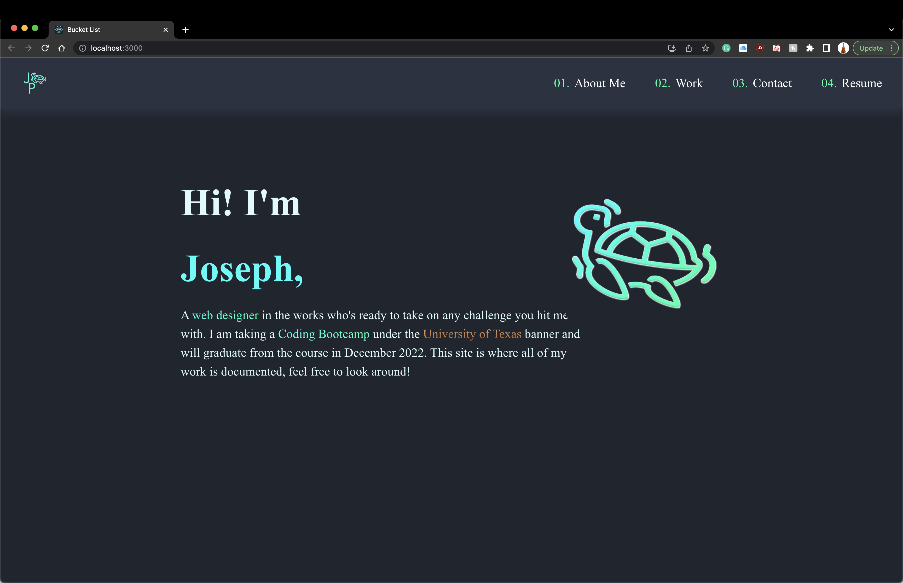

# ReactPortfolio

## Description

What was my motivation?

- My motivation for this project was to create my original portfolio in react, but not just create it, but improve upon it

Why did I build this project?

- I built this project to increase my knowledge of react

What problem does it solve?

- It solves the problem of haaving a simple html and javascript portfolio

What did I learn?

- I learned how to interact with react and input what I want to in its library format

## Table of Contents

- [Installation](#installation)
- [Usage](#usage)
- [Questions](#questions)
- [License](#license)

## Installation

Step 1: If downloaded localy, install depencies from opening up the integrated terminal and typing 'npm i'
Step 2: Then type 'npm run start' to start the application

## Usage

Deployed Application Link:

## Questions

Github Profile: josephpicardat

If you need to reach me, you can with through my email: josephpicardat1@gmail.com

## License

(https://opensource.org/licenses/MIT)

Copyright 2022 Joseph Picardat

Permission is hereby granted, free of charge, to any person obtaining a copy of this software and associated documentation files (the "Software"), to deal in the Software without restriction, including without limitation the rights to use, copy, modify, merge, publish, distribute, sublicense, and/or sell copies of the Software, and to permit persons to whom the Software is furnished to do so, subject to the following conditions:

    The above copyright notice and this permission notice shall be included in all copies or substantial portions of the Software.

    THE SOFTWARE IS PROVIDED "AS IS", WITHOUT WARRANTY OF ANY KIND, EXPRESS OR IMPLIED, INCLUDING BUT NOT LIMITED TO THE WARRANTIES OF MERCHANTABILITY, FITNESS FOR A PARTICULAR PURPOSE AND NONINFRINGEMENT. IN NO EVENT SHALL THE AUTHORS OR COPYRIGHT HOLDERS BE LIABLE FOR ANY CLAIM, DAMAGES OR OTHER LIABILITY, WHETHER IN AN ACTION OF CONTRACT, TORT OR OTHERWISE, ARISING FROM, OUT OF OR IN CONNECTION WITH THE SOFTWARE OR THE USE OR OTHER DEALINGS IN THE SOFTWARE.
